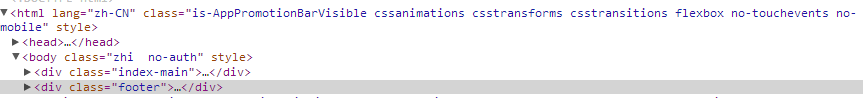
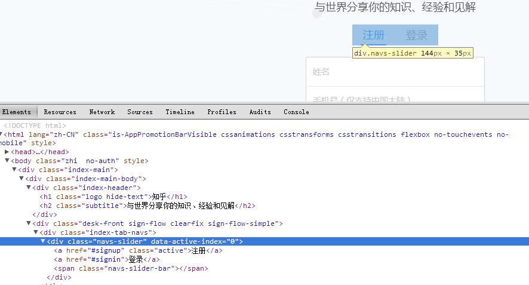
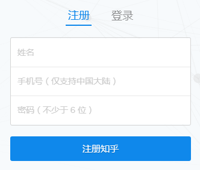

#知乎登录页找茬:smile:
##第一茬:one:

####此处应该用语义化HTML标签`<footer>`，而不该使用class属性为footer的`
`标签
##第二茬:two:

####由于登录注册按钮具有导航标签的作用，所以此处应该使用`<nav>`标签，而不应该使用`
`标签嵌套`<a>`标签
##第三茬:three:

####此处我认为严格来讲不能算作错误，而是有待改进的地方，因为登录注册表单的交互目的很明显，就是引导用户填写信息登录或者注册，所以我认为表单中第一行文本框添加上`autofocus`属性更好
