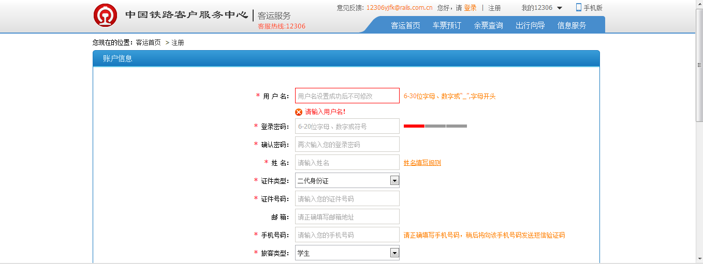
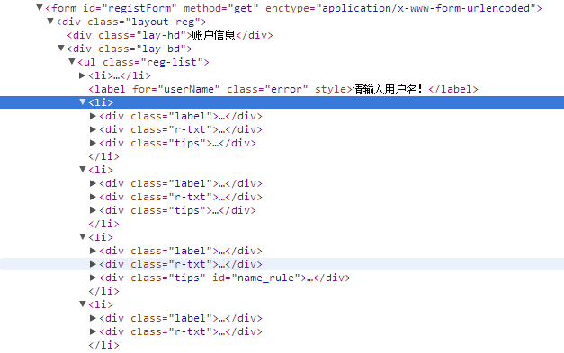

#12306注册页面表单优化:bullettrain_side::bullettrain_side::bullettrain_side:
####上图中表单对应的的HTML结构如下图所示

####我们可以看出诸如“用户名”、“登录密码”这种每一行表单项，在HTML中是通过`<li>`标签嵌套多个`<div>`标签实现的，这种做法既违背了标签语义化的原则，也为通过CSS增添样式带来不必要的麻烦。
####以下是12306目前的表单代码片段
```html
<li>
	<div class="label">
		<span class="required">*</span>用 户 名：
	</div>
	<div class="r-txt">
		<input type="text" placeholder="用户名设置成功后不可修改" class="inptxt w200 error" name="loginUserDTO.user_name" id="userName" maxlength="30" style="color: rgb(51, 51, 51);">
	</div>
	<div class="tips">
		<span id="iok_userName" class="tips i-ok" style="margin-top: 10px; margin-right: 5px; display: none;">
		</span>
		6-30位字母、数字或“_”,字母开头
	</div>
</li>
```
以下为我修改后的代码
```html
<section>
	<label>* 用户名<input type="text" placeholder="用户名设置成功后不可修改" maxlength="30" /></label>
	<label>6-30位字母、数字或“_”,字母开头</label>
</section>
```
####修改后的代码既遵循了HTML语义化的原则，同时也不需要太多CSS去对样式进行修饰，同时代码量也极大缩减。
####上面仅就“用户名”这一行的表单结构进行了优化，其他的表单也遵循一样的原则。整体的代码结构如下
```html
<form id="registForm" method="get" enctype="application/x-www-form-urlencoded">
	<article>
		<header>账户信息</header>
		<article>
			<section class="userName">
				<label>* 用户名<input type="text" placeholder="用户名设置成功后不可修改" maxlength="30" /></label>
				<label>6-30位字母、数字或“_”,字母开头</label>
			</section>
			<section class="password">
				<label>* 登录密码<input type="password" placeholder="6-20位字母、数字或符号" maxlength="25" /></label>
				<label>请输入密码</label>
			</section>
			<section class="cardType">
				<label>
					* 证件类型
					<select>
						<option value="1">二代身份证</option>
						<option value="C">港澳通行证</option>
						<option value="G">台湾通行证</option>
						<option value="B">护照</option>
					</select>
				</label>
			</section>
			<section class="telephone">
				<label>* 手机号码<input type="text" placeholder="请输入您的手机号码" maxlength="30" /></label>
				<label>请正确填写手机号码，稍后将向该手机号码发送短信验证码</label>
			</section>
		</article>
	</article>
</form>
```