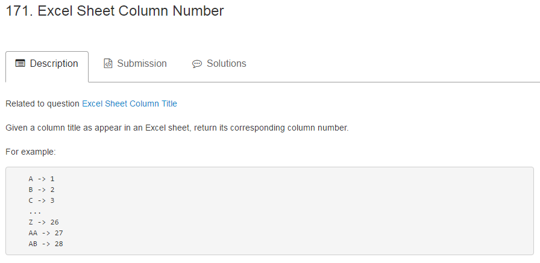

##第一题：Excel表格列头

###题目描述如图所示
####题目中枚举出的例子已经很清楚地揭示了其中的规律，将1~26的数字分别对应大写英文字母A~Z，需要实现一个26进制的数字向大写字母的转换。所以会很自然地想到用给定的数值n除以26求余的方法。
####那么余数如何与大写字母相对应呢？我想到了借用`String.fromCharCode()`方法，这个方法接受一个数值作为参数，返回该数值对应的编码的字符，我们知道A对应的编码值是65，后面的字母编码值依次加一，所以当存在余数mod的情况下，我们只需要用`String.fromCharCode(mod + 64)`就能够对应到匹配的字母。而当在整除的情况下，即mod为0，那么此时对应的字母为Z，所以只需要区分一下这两种情况即可。
####另外就是涉及到进位的问题，可以采用循环的方式，每次循环当中借用```n = Math.floor((n - 1) / 26)```去判断是否需要进位。
```JavaScript
var convertToTitle = function(n) {
    var mod,string = "";
    while(n>0){
        mod = n % 26;
        if(mod){string = String.fromCharCode((mod + 64)) + string;}
        else{string = 'Z' + string;}
        n = Math.floor((n - 1) / 26);
    }
    return string;
};
```
##第二题：Excel表格列数值

###题目描述如图所示
####此题和上一题是一个相反的过程，是将大写字母转换成相应的数字。相比于上一题来说要简单一些。这种对应关系，我们采用`String.fromCharCode()`的一个逆方法`String.prototype.charCodeAt()`,这个方法返回字符串中某一位字符所对应的编码值。即`string.charCodeAt(i)-64`,同时需要乘以该位的权重，即`Math.pow(26,string.length-i-1)`。
```JavaScript
var titleToNumber = function(s) {
    var sLength = s.length, number = 0;
    for (var i = sLength - 1; i >= 0; i--){
        number += (s.charCodeAt(i) - 64)*Math.pow(26,sLength-i-1);
    }
    return number;
};
```
##第三题：统计一串二进制数中“1”的个数

###题目描述如图所示
####这道题拿过来一看就很简单了，最容易想到的方法就是一位一位地移动指针去寻找字符串中“1”的个数，可以借用JS当中的`String.prototype.indexOf()`方法（不要忘记先将数值转换为二进制数），代码如下：
```JavaScript
var hammingWeight = function(n) {
    var binNum = n.toString(2);
    var i = 0;
    var pos = 0;
    while(binNum.indexOf("1",pos) != -1){
        pos = binNum.indexOf("1",pos);
        pos++;
        i++;
    }
    return i;
};
```
这样一点一点移动指针，看起来不是很优雅，我们一个借用字符串的另一个方法，`String.prototype.split('0')`,这样该方法返回的值就是通过数字0分隔的数组（元素只剩1），然后再用`Array.prototype.join('')`将数组转换为字符串，该字符串的长度即为原字符串中1的个数。
```JavaScript
var hammingWeight = function(n) {
		var binNum = n.toString(2);
    return (binNum.split('0').join('').length);
};
```