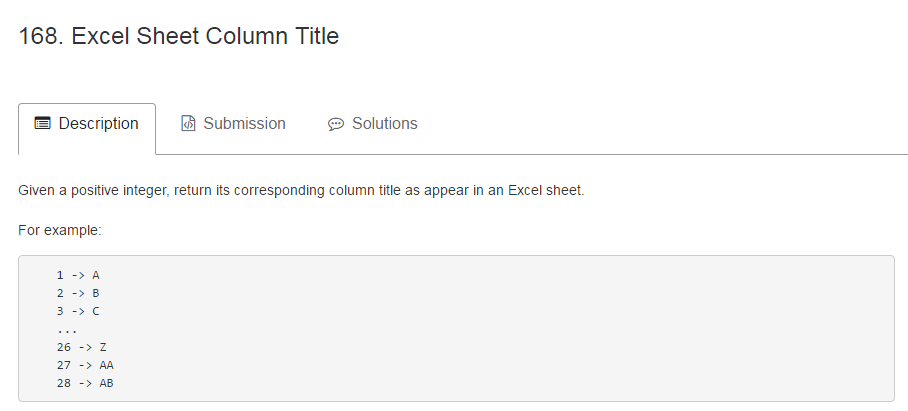

##第一题：Excel表格列头

###题目描述如图所示
####题目中枚举出的例子已经很清楚地揭示了其中的规律，将1~26的数字分别对应大写英文字母A~Z，需要实现一个26进制的数字向大写字母的转换。所以会很自然地想到用给定的数值n除以26求余的方法。
####那么余数如何与大写字母相对应呢？我想到了借用`String.fromCharCode()`方法，这个方法接受一个数值作为参数，返回该数值对应的编码的字符，我们知道A对应的编码值是65，后面的字母编码值依次加一，所以当存在余数mod的情况下，我们只需要用`String.fromCharCode(mod + 64)`就能够对应到匹配的字母。而当在整除的情况下，即mod为0，那么此时对应的字母为Z，所以只需要区分一下这两种情况即可。
####另外就是涉及到进位的问题，可以采用循环的方式，每次循环当中借用```n = Math.floor((n - 1) / 26)```去判断是否需要进位。
```JavaScript
var convertToTitle = function(n) {
    var mod,string = "";
    while(n>0){
        mod = n % 26;
        if(mod){string = String.fromCharCode((mod + 64)) + string;}
        else{string = 'Z' + string;}
        n = Math.floor((n - 1) / 26);
    }
    return string;
};
```