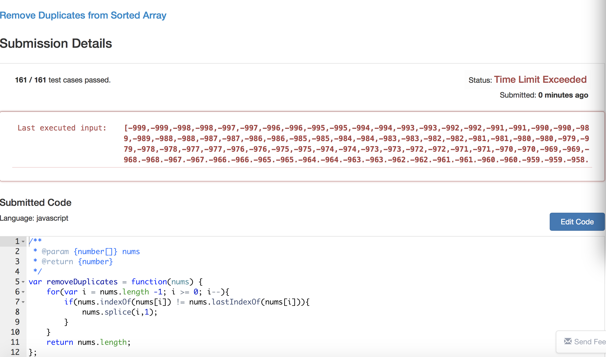

#Remove Duplicates from Sorted Array
  
Given a sorted array, remove the duplicates in place such that each element appear only once and return the new length.
Do not allocate extra space for another array, you must do this in place with constant memory.
For example, Given input array,Your function should return length = 2, and A is now.

###解题思路：
1. 用索引取值比较来去重
2. 从后往前进行一次循环，这样子不用担心数组长度的问题。

<pre>
/**
 * @param {number[]} nums
 * @return {number}
 */
var removeDuplicates = function(nums) {
    for(var i = nums.length -1; i >= 0; i--){
        if(nums.indexOf(nums[i]) != nums.lastIndexOf(nums[i])){
            nums.splice(i,1);
        }
    }
    return nums.length;
};
</pre>

但是虽然用例都通过了，最后一个特别长的用例超时了。

再仔细看了题目，是排序过的数组，所以问题解决起来可以缩小范围了

<pre>
/**
 * @param {number[]} nums
 * @return {number}
 */
var removeDuplicates = function(nums) {
    var ans = 0;
  for (var i = nums.length; i--; ) {
    if (i === nums.length - 1)
      ans++;
    else if (nums[i] === nums[i + 1])
      nums.splice(i, 1);
    else 
      ans++;
  }
  return ans;
};
</pre>

