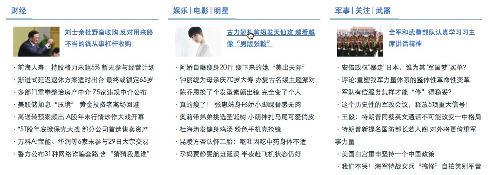
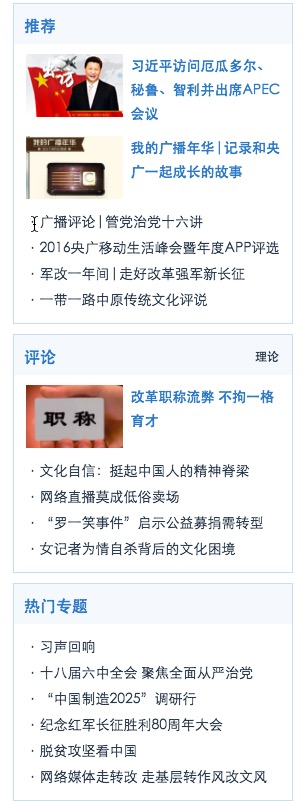

###作业一


*网站：央广网CNR*

0. 整个网站没有h1标签
1. 头部尾部应该采用header与footer标签
2. 导航部分应该用nav标签
3. 下面的结构应该用

```
<article>
	<section></section>
	<section></section>		
	<section></section>
</article>
```

5. 图片与标题应该用

```
<figure>
	
	<figcaption></figcaption>
</figure>	
```

6.下图应该用`<aside></aside>`



